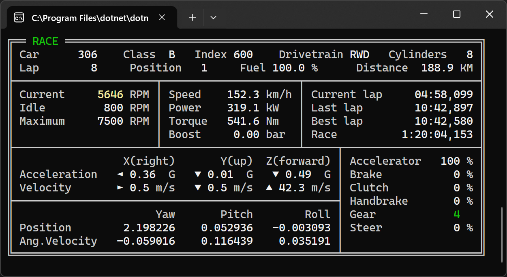

# Forza Data (Web)

Forza Motorsport and Forza Horizon real time telemetry receiver programs, with some utility tools.

Based on Turn10 official documentation:
https://support.forzamotorsport.net/hc/en-us/articles/21742934024211-Forza-Motorsport-Data-Out-Documentation

## Supported features

Only a console program is available at this moment. It displays live data at 60 Hz.



Data can be recorded using a sample recorder program, and will be replayable at a later date.

Web UI will be supported later, when core functionalities are stable.
It should leverage [WebSockets](https://developer.mozilla.org/en-US/docs/Web/API/WebSockets_API), most probably from [SignalR](https://dotnet.microsoft.com/en-us/apps/aspnet/signalr), to receive live or previously-recorded data at 60 Hz.

## Protocol compatibility

### Sled vs Car Dash

_Sled_ data is for SimRacing motion platforms, so it contains motion values and a few other ones.

_Car Dash_ extends _Sled_ data with car-dashboard related metrics, eg. speed, power, torque, gear, lap times, etc.

To see all available data fields, please have a look on the data structure files:
- [Sled structure](Core/ForzaSledDataStruct.cs)
- [Car Dash structure](Core/ForzaCarDashDataStruct.cs)
- [Horizon extras structure](Core/ForzaHorizonExtrasDataStruct.cs)
- [Motorsport extras structure](Core/ForzaMotorsportExtrasDataStruct.cs)

### Game Support

| Game                    | Sled     | Car Dash | Horizon extras | Motorsport extras |
|-------------------------|----------|----------|----------------|-------------------|
| Forza Motorsport 7      | Yes      | Yes      | N/A            | N/A[^3]           |
| Forza Horizon 4         | Yes[^1]  | Yes      | Partial[^2]    | N/A               |
| Forza Horizon 5         | Yes[^1]  | Yes      | Partial[^2]    | N/A               |
| Forza Motorsport (2023) | Yes      | Yes      | N/A            | Yes[^4]           |

[^1]: Forza Horizon enforces Car Dash data type
[^2]: Forza Horizon extra data is not documented. Only the car category (from community assumptions) is decoded. Thanks to them !
[^3]: Forza Motorsport extra data was introduced in 2023 edition, FM7 doesn't emit such data
[^4]: Forza Motorsport (2023) extra data exposes tire wear and track ID

## How to run

Supported operating systems are the same as [.NET 8 compatibility](https://github.com/dotnet/core/blob/main/release-notes/8.0/supported-os.md) : Windows, Linux and macOS.

Prebuilt executables are not yet available in GitHub releases, but it's really easy to build the source code yourself.

### Prerequisites

1. [Git](https://www.git-scm.com/downloads) to get the source code
2. [.NET 8.0 SDK](https://dotnet.microsoft.com/en-us/download/dotnet) to build the source code

### How to get source code

```shell
git clone https://github.com/geeooff/forza-data-web.git
cd forza-data-web
```

### How to enable Data-Out feature in the game

> **Note for Windows as both game and receiving app**:
> Only Forza Motorsport (2023) allows to send data to 127.0.0.1.
> For earlier games you will need a separate compute to receive the data.

Start the game on your Windows computer or your Xbox.
Go to game options and look for _Data Out_ options :
1. `Data Out IP Address` : enter the IP Address of **the computer that will run the console program**
2. `Data Out IP Port` : enter the network port you want to **listen on this computer** (1024 to 65535)
3. `Data Out Packet Format` : if available, choose **Car Dash** (recommended) or **Sled**
4. `Data Out` : set to **ON**

### How to run the console program

```shell
cd Console
dotnet run --server <serverIpAddress> --port <port>
```

#### Arguments

- `-s` or `--server` : the IP Address of your Xbox or Computer that runs the game
- `-p` or `--port` : the network port you chose in the game

#### Example

For example, if your Xbox or Windows Game Computer has `192.168.0.100` IP Address, and you chose `7777` network port to communicate:

```shell
dotnet run --server 192.168.0.100 --port 7777
```

The console will show `RACE` or `PAUSE` in the top left corner if race is on or not.

_Note_ : To quit the program just hit `CTRL+C` or `CTRL+Break`.

### How to record a sample

```shell
cd SampleRecorder
dotnet run --server <serverIpAddress> --port <port> --output <file>
```

#### Arguments

- `-s` or `--server` : the IP Address of your Xbox or Computer that runs the game
- `-p` or `--port` : the network port you chose in-game
- `-o` or `--output` : the output file to record to

#### Example

```shell
dotnet run --server 192.168.0.100 --port 7777 --output sample.bin
```

_Note_ : If you want to quit the recorder program, just hit `CTRL+C` or `CTRL+Break`.
The output file will be deleted if no data is received.
